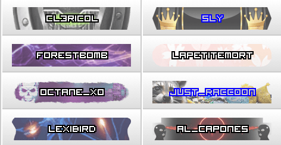
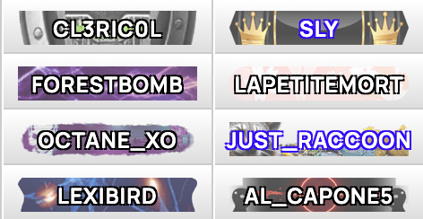
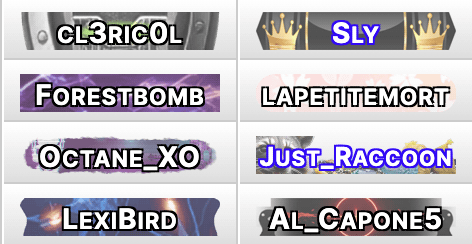

# Torn: More Legible Usernames

**This is a fork of [Torn: More Legible Player Names](https://greasyfork.org/en/scripts/531629-torn-more-legible-player-names) by [GingerBeardMan](https://www.torn.com/profiles.php?XID=2532521) who did the vast majority of the work**.

<table>

  <tr>
    <td><b>Standard</b></td>
    <td><b><a href="https://www.torn.com/profiles.php?XID=2532521">GingerBeardMan</a></b></td>
    <td><b>This</b></td>
  </tr>

<tr>
  <td></td>
  <td></td>
  <td></td>
</tr>

</table>

Makes names on Honor Bars more legible for those of us with old-people eyes.

## Differences from the original

* Uses [small caps](https://en.wikipedia.org/wiki/Small_caps) so you can see the difference between PEDROXIMENZ and PedroXimenez
* Uses a bigger, more legible basic font, and scales it down when needed
* Removes the hidden overflow, so you don't get "..." instead of usernames
